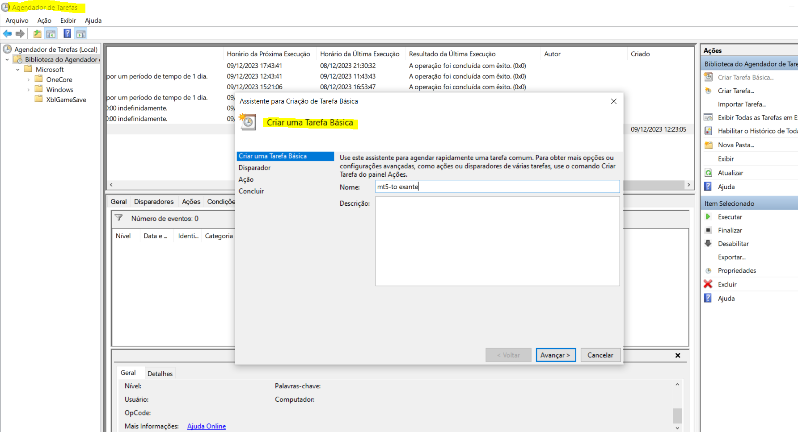
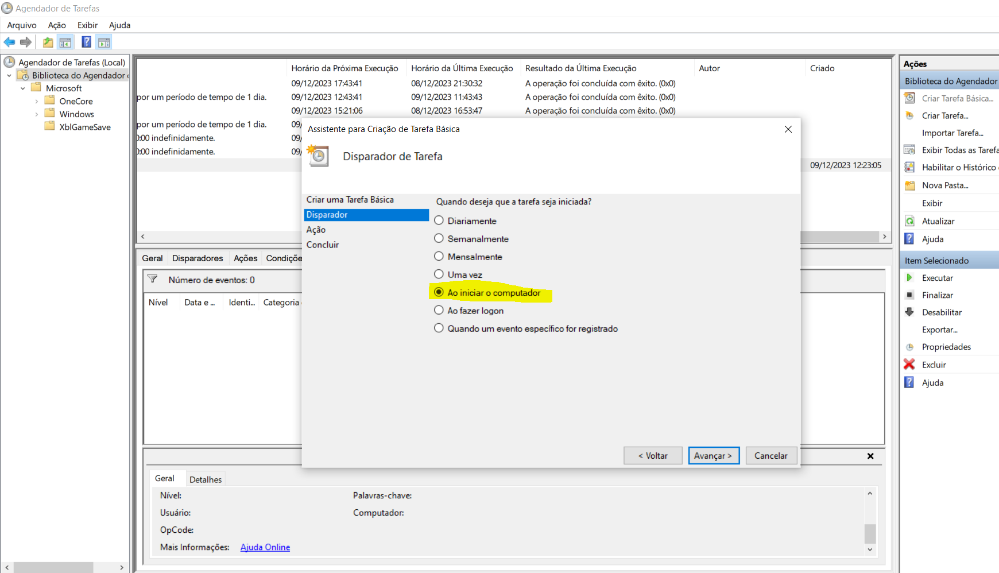

# mt5-to-exante

This project enable integration between MetaTrader HomeBroker and Exante's APIs.

Exante API documentation:
https://exante.eu/pt/all-apis/http-api/

The project goal is to provide full integration and allow the use of MetaTrader HomeBroker with Exante's services.

# How it works
The SDK provided as a `.exe` file is a simple API that communicates to Exante`s API. All installation is in your LOCAL MACHINE (the same one that MetaTrader is installed) and all communication between MetaTrader and the SDK is via local webService. 

To the SDK works is necessary to have your OWN personal API Key, this SDK is only a bridge between MT5 order and Exante's API.

# Installation

## Configure and RUN SDK:
1. Go to the latest tag [link](https://github.com/danielsussa/mt5-to-exante/tags)
2. download `mt-to-exante-sdk.exe`
3. download `production.env` and `developer.env`
4. replace `*.env` values with your own API KEYS
5. run app with command line argument `mt-to-exante-sdk.exe production`

## Configure MT5 scrips:
1. download `JAson.mqh` and `mt-to-exante.mq4`
2. copy `JAson.mqh` to folder `...\MQL5\Include\JAson.mqh`
3. copy `mt-to-exante.mq4` to folder `...\MQL5\Experts\mt-to-exante.mq4`
4. allow MT5 to call external services:

5. Add Expert to target chart

# Folder structure

```shell
├── mt-to-exante
   └── mt-to-exante-sdk.exe
   └── developer.env
   └── production.env
   └── exchanges.yaml
├── .../MQL4
   └── Includes
      └── JAson.mqh
   └── Experts
      └── mt-to-exante.mq4
```

# Run SDK on Windows Startup

To run the SDK on windows bootstrap use the WINDOWS TASK MANAGER to add it. Follow the steps bellow:


